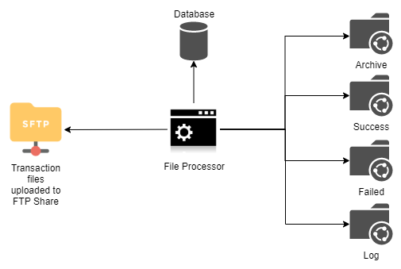

# Application Configuration from Operations Viewpoint

All the software applications would have some configuration. This post is about seeing the configuration from operations viewpoint: its challenges and some methods to manage it better.

> Operations here simply means the process of running a software application in any environment like Dev, Test, UAT, Prod, etc.

First let's understand which configuration is being discussed here and what are the challenges.

# The Problem

Configuration give broadly two capabilities without modifying the software:

1. Ability to change the behavior
1. Provide inputs from outside to make the same software work in different environments or work with different attributes e.g., database connection settings to make it work with different instances of a Database as long as they support same interface

Configurability increases complexity but it is required to quickly adapt to the changes especially in Software Products which have to cater to different use-cases in different types of environments. Configurability provides capability to meet those requirements quickly.

The configurations will be of two types:

1. Settings set by the end users
1. Configured by the Operations team

**#1** is generally well documented and managed by the end users. **#2** is where there are some challenges such as:

1. It often happens that during the process of development, configurations are added by developers and they are very familiar with what should be the correct values but the Operations team / person doesn't have or get that clarity. 
1. As a solution grows, number of configurations grow too and it becomes difficult if a new environment is to be set-up. One would often come across situations where only one or two people in the team can actually set-up the software in a new environment. This can be a serious bottleneck for Software Products where it can reduce the ability to quickly make the product available to customer.

Let's understand this with an example of simple file processor of the Biller Org. File processor processes the daily transaction files uploaded by parteners who accept payments on behalf of the Biller Org and provide transaction details to the Biller Org so that the Biller Org can update its systems to reflect the payments.



File Processor does the following:

1. Read files from FTP file share
1. Update the database
1. Store the original files to Archive, successfully processed to Success, files failed processing to Failed and the logs of each file processing to Log directories on a network share.
1. It can be set-up to run in two modes (a) process each item in file as one transaction i.e. write failed item to Failed but keep processing (b) proess entire file as one transaction i.e. either entire file is processed successfully or entire file is marked failed.

Let's see the configuration parameters we will need:

1. Database connection settings
1. FTP Share access settings
1. Paths of Archive, Success, Failed and Log shares
1. Flag to control the mode of transaction - File or Item

This needs to be set-up in every environment and for each partner, and in a real system there would many such jobs. 

# Mitigation

Configurability is beneficial and required so we can't completely do away with the problems discussed above, but there can be some ways it can be made more manageable as we see below - this is not an exhaustive list.

## Documenting with configuration

Document each parameter in the configuration file itself - or add a column in database if it is being kept in a database.

Continuing with our example, the configuration file can be like this:

``` yaml
# USE: Control transaction mode of the processing.
# EXPECTED VALUE:
#  ITEM - Consider each item as one transaction
#  FILE - Consider entire file to be one transaction
app.transaction-mode: ITEM
#
# USE: Store original files after processing
# EXPECTED VALUE: Full path to the directory
app.archive-path: <some path>
#
# USE: Store failed files after processing
# EXPECTED VALUE: Full path to the directory
app.failed-path: <some path>
```

*This could be made part of the Code Review process where a new configuration without enough documentation is not accepted.*

This will make sure that anyone can get a good idea of what to do right in the place where the values need to be configured.

## Convention over configuration

Convention over configuration is used by many frameworks to reduce the amount of configuration \ boilerplate code required - all MVC frameworks follow this pattern. The same can applied in application configurations.

In the above example, the number of configurations can be reduced:

``` yaml
# USE: Control transaction mode of the processing. Set if you want to change Default.
# EXPECTED VALUE:
#  ITEM - Consider each item as one transaction
#  FILE - Consider entire file to be one transaction
# DEFAULT: ITEM.
# app.transaction-mode: ITEM
#
# USE: Store output files after processing. Program will create Archive, Success, Failed and Log directory under this path.
# EXPECTED VALUE: Full path to the directory
app.output-path: <some path>
```

The reduction is due to following two conventions:

1. Default transaction mode is assumed to be ITEM if it is not set. So you only configure the parameter, if you need to change the default. Default can be decided based on commonly expected value.
1. Instead of taking four directory paths, take path of root and then always create directories under that: Archive, Success, Failed, Log. This will potentially reduce some flexibility, but improve maintainability.

## Scripts / Tools to detect errors

If you have an application that runs on 100s or 1000s of desktops (or simply machines irrespectivev of they are servers or desktops) and the configuration resides on those machines, it is very difficult to troubleshoot issues as you do not have access to the machine and can't check whether all the configuration parameters are correct or not. Having some script or utility that can scan the configuration and highlight any problems can greatly help the operations.

> AWS has a service named AWS Config which can be configured to monitor compliance to a desired configuration of your environment. It will highlight if it detects any violation from the desired state e.g., it is configured to monitor that only port 443 should be open on EC2 Instances so it will raise an alert if it finds some other port open on the server.

# Configuration in Containerized Deployments

Containers are started from an image which has the application installed in it. Now, if configuration is included in the image along with application, an image is required for each environment - or each change to configuration.

Therefore, configuration needs to be *externalized*. Common pattern is to keep the configuration in a repository, vault, shared storage, etc. and provide the application access parameters to the store by setting environment variables in the container.

# Configuration in Single Page Applications

Dynamic configuration is not straightforward in an SPA e.g, you want to toggle some features in some environments, feed API endpoints that SPA should use dynamically rather than at build time.

This is so because SPAs are bundled and the bundle is referenced in landing page. Browser retrieves the bundled file from server and executes it which loads the SPA and starts its lifecycle. So the SPA execution is entirely on the client i.e. browser and it is not possible to inject configuration like we do on server or an application installed on desktop.

This [article](https://medium.com/angular-in-depth/handling-angular-environments-in-continuous-delivery-eeaee96f0aae) explains the problem and possible solutions in the context of Angular.

# Conclusion

Key takeaway is that running highly configurable software can also be a challenge: configurability can become a liability instead of an asset. Managing configuration should also be a criteria during design and development.