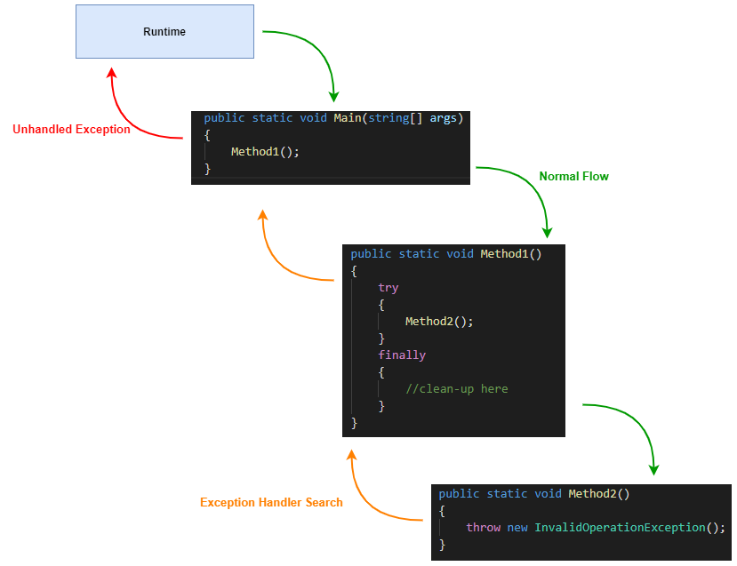
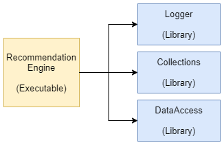
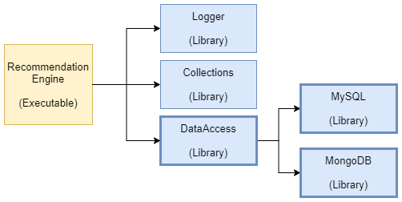
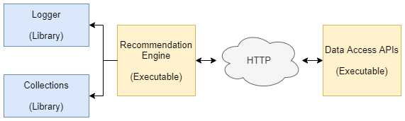
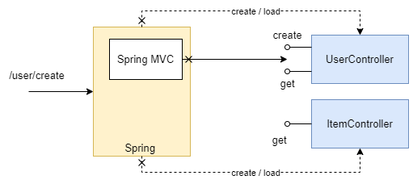

# Exception Handling in Different Types of Applications

# Introduction

Exception handling is common to most programming languages and the mechanisms and behaviours are similar in most languages: try\catch\finally. It is well documented. We are not going to discuss that.

However, different approach to exception handling is required in different types of applications like a Library, a UI application, a Framework, etc., and that is the focus of this post. We'll see how exception handling needs to change depending on the nature of the application.

Let's start with some fundamentals.

# What is an exception?

Exception is an event during the execution of a program that disrupts the normal flow and prevents the program from doing what it is expected to do e.g., a program tries to write to a log file but the file cannot be opened.

In such error conditions, runtime looks for handlers (try-catch) that are registered to handle such excceptions and when a handler is found, it is invoked with an Exception object having information about the event. The following diagram shows the normal flow of the program (Runtime &gt; main &gt; Method1 &gt; Method2) and the flow when an exception occurs.



When an exception is not handled by a program, it reaches the runtime where it will be considered unhandled exception which may result in a crash.

> **Two Pass vs One Pass** 
>
> .Net Runtime has Two Pass exception handling implementation. Two Pass means the runtime first traverses through entire call stack to find a handler, and after either finding a handler or determining that its an unhandled exception, it runs all the *finally* blocks in the call stack.
>
> JVM on the other hand runs finally block in a method if a handler is not found in that method and then it moves up the call stack.
>
> See [CLR Exception Handling](https://devblogs.microsoft.com/dotnet/the-good-and-the-bad-of-exception-filters/) and [JVM Exception Handling](https://www.infoworld.com/article/2076868/how-the-java-virtual-machine-handles-exceptions.html) for detailed explanation.


**Async Execution**

Exception handling in asynchronous execution is important to understand. Let's see with an example.

The following is a Java code that runs a method on new thread and exits.

```java
public class AsyncRun implements Runnable {
  @Override
  public void run() {
        // TODO Auto-generated method stub
    System.out.println("AsyncRun.run on thread " + Thread.currentThread().getId());
    throw new ArithmeticException();
  }    
}

public static void main( String[] args ) {
  try {
    Thread t = new Thread(new AsyncRun());
    t.start();
    System.out.println( "main on thread " + Thread.currentThread().getId());
    throw new NullPointerException();
  }
  catch(Exception ex)
  {
    System.out.println(ex.getClass().getName() + " handled");
  }
}
```

This would be the output:

```
main on thread 1
AsyncRun.run on thread 15
java.lang.NullPointerException handled
Exception in thread "Thread-0" java.lang.ArithmeticException
        at exceptionhandling.AsyncRun.run(AsyncRun.java:13)
        at java.base/java.lang.Thread.run(Thread.java:835)
```

*NullPointerException* thrown by the *main* method is handled by the try-catch in *main*, but the exception in *AsyncRun.run* method is treated as an unhandled exception because JVM could not find a handler in the call stack on the thread running *AsyncRun.run*. *AsyncRun.run* is the first method to be called on the thread so the call stack ends there, the try-catch in the *main* method won't apply to *AsyncRun.run*. 

However, unlike main thread, unhandled exception on a separate thread did not result in a crash. .Net has same behaviour as Java for async execution.

**Alternative to Excptions**

Alternative to Exceptions is error handling, but for that program has to validate all scenarios and return different error codes e.g., a function writing to log files would have to first check if file exists and then return an error code if it doesn't, and the calling function needs to check the return value to see if the call was successful or not. This can be very unproductive and error prone.

# Why handle exceptions?

Exception handling is required primarily for the following reasons:

1. **Prevent crashes (PC)**: Unhandled exception may result in application crash. So even to prevent a crash an application needs to handle exceptions.
1. **Alternate flow (ACF)**: In some cases, there may be a need to change the flow of the program in the event of an error condition e.g., in online shopping portal, when a payment API request throws exception, user journey would require the application to handle it and take the user back to the basket page so that user can initiate the payment again.
1. **Logging (LOG)**: This is required for troubleshooting.

# Where to handle exceptions?

**Where** to handle exception is very important and broadly there are two types of places where exceptions should be handled:

1. All **Entry Points** in to the program \ application to prevent crashes. As we have seen above when an exception reaches the runtime or framework, it may cause a crash. Entry Points can be one or more like:
  1. main method
  1. Event handlers in a UI application - SPA or desktop application
  1. Public methods on a Controller in MVC
  1. Starting method of a background thread
1. To support different flows in the event of an error, exception handling is required where such diversions need to be implemented.

# Exception Handling by Application Types

Now let's try to see how all this applies for different application types:

## Library

* A library is a set of functions / classes focusing on some problem domain. 
* Libraries do not control the flow of program. Functions of libraries are called by the main program with some input and they return some output or provide some behaviour e.g, RecommendationEngine executable uses libraries for logging, data access, etc. to perform its job but the flow of program is controlled by the executable only.



* Responsibility to prevent a crash or implement an alternate flow lies with the main program. 
* Therefore, code in a library *should not supress exceptions* because that would prevent the calling application from fullfilling alternate flow and logging requirements - it can catch exceptions and rethrow or provide expected output by catching expcetions.

* There can be scenarios where a library needs to handle exceptions like in the following case, but it should not suppress the exceptions. E.g., continuing with the above example, let's say the data can come from MySQL or MongoDB so DataAccess library itself relies on other libraries. But to make *RecommendataionEngine* depend only on *DataAccess* library, *DataAccess* library can handle exception from *MySQL* and *MongoDB* and then throw its own exception. Re-throwing would ensure that *RecommendationEngine* gets a chance to decide what to do with exception.



## API

* APIs can be thought of as a library of functions exposed over a network e.g., continuing earlier example, if there is a decision to expose Data Access APIs as REST APIs, it would look like the following.



* As in the case of Library, the caller of API (RecommendationEgine) should handle the exception, but because of the change in nature of invokation of Data Access APIs, exceptions need to be handled for the following reasons:
  * *Data Access API as Library*: in this case, when an exception occurs, the caller (RecommendationEngine) is in same process and the runtime lets it handle the exception - also the exception object would provide details about what happened so that caller can take appropriate action.
  * *Data Access API as REST API*: here the caller (RecommendationEngine) is not in the same process. Caller is expecting a valid HTTP response from the REST API. So if the API itself doesn't handle exception, the framework (ASP.Net MVC, Spring MVC, etc.) has to handle it and return a valid HTTP response, which may not provide enough details to the caller about the error.
  * So REST API itself should handle the exception and return a response that the caller can use to determine that there was an error. In this case, the response will have to carry error codes and caller should perform actions based on error codes.

## UI Application

* Almost all UI applications are written using some framework with the framework calling the application when there is some event. This makes the event handlers an entry point in to the application so exceptions should be caught on event handlers.

* Additional exception handling in a UI application will vary based on what the application is doing e.g, if the application is doing work on background threads, the entry points \ starting methods of the thread should handle exceptions.

## Framework

* Framework is implemenation of Inversion of Control pattern. Framework discovers, loads and calls its plug-ins on events a plug-in is interested in. Both the framework and the plug-ins communicate with each other using known public interfaces e.g,



* This is how it works:
  * (a) Spring (framework) **discovers** controllers with *@Controller* annotation on a Class
  * (b) DI container would **initialize**  the classes (or load plug-in) by calling their constructors
  * (c) when a HTTP request for a matching URL is received, Spring MVC calls appropriate method on the Controller class and returns the response.

* In the above diagram the calls from Spring to the application - marked with **X** - are vulnerable points as Spring cannot assume that the application would not throw exceptions, so it would handle exceptions e.g., if *UserController.create* method throws exception, Spring MVC would handle it and trigger alternate flow to return an appropriate HTTP response indicating error.

* So a framework must handle exception in all the places where it is invoking methods on its plug-in. 

* Framework itself cannot be the reason for a crash so it must make sure that it internally doesn't allow any exception to go unhandled and reach the runtime because that may result in a crash.

# Summary

Any application should not let exceptions go unhandled with the exception of Libraries. At the minimum, all exceptions should be handled at the entry points in to the application. 