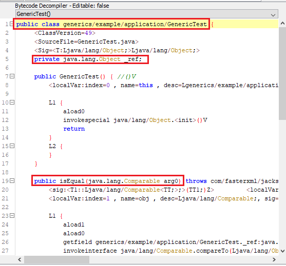
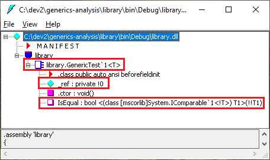
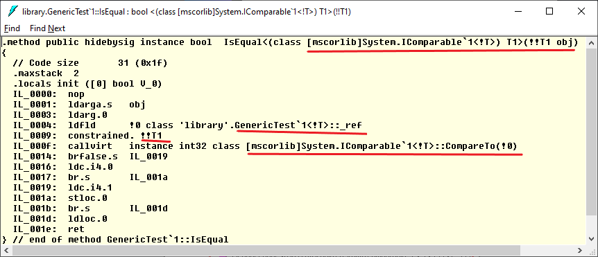

# Introduction

Generics are very powerful and commonly used in both Java and C# programming - especially in frameworks and libraries. 

Generics primarily provide type safety and improved performance by avoiding the need to cast variables.

If you have been using C# generics and then use generics in Java - or vice versa, you will notice that both Java and C# generics look very similar. But they are very different in terms of how they are implemented and as a result what capabilities they have. We'll see that in the rest of this post.

# Generics Implementation

Generics support in a language is required at both **compile time** and **run time**. Let's use an example to understand this better.

* A library *common-lib* declares a generic type as shown below. This library is built and published which is then used in other programs.
```java
public class GenericTest<T> {
    private T _ref;
}
```
* An application named *demo-app* uses *common-lib*
```java
public class App{
    public static void main(String[] args){
        GenericTest<MyClass> t = new GenericTest<MyClass>();
        GenericTest<SomeClass> s = new GenericTest<SomeClass>();
        //s = t; //allowed? type safety?
    }
}
```
* *common-lib* and *demo-app* are physically different artifacts. When *demo-app* is compiled, the compiler needs to know that GenericTest&lt;T&gt; is a generic type so it should be treated differently. Therefore when *common-lib* is compiled, the compiled output should have information about the generic type. This will allow compiler to ensure type safety in *demo-app* at compile time - both Java and C# guarantee compile time type safety.

* Reflection is supported by both Java and C#. Reflection APIs allow accessing type information at run time and create new objects, call methods on an object, etc. at run time. To support all these operations on generic types, generics support is required at run time also.

# Java Generic Code Lifecycle

## Compilation

Java uses the concept of [Type Erasure](https://docs.oracle.com/javase/tutorial/java/generics/genTypes.html) to support Generics in Java. Through Type Erasure, Java compiler converts all Generic type references to non-generic types at the time of compilation. Type Erasure approach was used to provide backward compatibility so that non-generic types can be passed to newer code written using generics.

Let's understand with an example. The following is a simple generic class.
```java
public class GenericTest<T> {

	private T _ref;
	
	public <T1 extends Comparable<T>> boolean isEqual(T1 obj){
		return obj.compareTo(this._ref) == 0 ? true : false;
	}
}
```
When this class is compiled, the generic type parameters are removed and replaced with non-generic equivalents. Following is the generated byte code - shown by [Bytecode Viewer](https://github.com/Konloch/bytecode-viewer):



See the difference between source code and the compiled version:

```java
//source code
public class GenericTest<T>
//compiled code - GenericTest<T> became just GenericTest
public class generics/example/application/GenericTest

//source code
private T _ref;
//compiled code - T was replaced with Object
private java.lang.Object _ref;

//source code
public <T1 extends Comparable<T>> boolean isEqual(T1 obj)
//compiled code - T1 became Comparable because
//of constraint that T1 should be subtype of Comparable<T>
public isEqual(java.lang.Comparable arg0)
```
Compiled Java code does not have any trace of generic types. Everything is mapped to a raw Java type.

One of the side effects of Type Erasure is that *GenericTest&lt;T&gt;* and *GenericTest* are same after Type Erasure by the compiler, so it is not possible to have both in same package.

## Runtime

At JVM level, there are no generic types. As explained in the earlier section, Java compiler removes all traces of generic types so the JVM doesn't have to do anything different to handle generic types.

# C# Generic Code Lifecycle

## Compilation

Following is the equivalent C# code of the above example in Java:
```csharp
public class GenericTest<T>
{
    private T _ref;

    public bool IsEqual<T1>(T1 obj) where T1 : IComparable<T>
    {
        return obj.CompareTo(this._ref) == 0 ? true : false;
    }
}
```
When the above code is compiled, the C# compiler retains the generic type information, which is used by the .Net Runtime to support generics.

A peek in to compiled library using [IL Disassembler]
(https://docs.microsoft.com/en-us/dotnet/framework/tools/ildasm-exe-il-disassembler):



IL Code of *IsEqual* method (same as byte code of Java) - see underlined sections:



## Runtime

.Net Runtime (CLR) uses the generic type information in the compiled code to create concrete types at runtime. Let's understand with an example.

Following code creates three objects of GenericTest&lt;T&gt; for three different types.

```csharp
GenericTest<int> intObj = new GenericTest<int>();
GenericTest<double> doubleObj = new GenericTest<double>();
GenericTest<string> strObj = new GenericTest<string>();
```
When this code is run, the .Net Runtime would create three concrete types dynamically based on the original GenericTest&lt;T&gt; generic type definition:

1. **GenericTest&lt;int&gt;**: T replaced with *int*. This type will be used to create all new objects of type GenericTest&lt;int&gt;
1. **GenericTest&lt;double&gt;**: T replaced with *double*. This type will be used to create all new objects of type GenericTest&lt;double&gt;
1. **GenericTest&lt;Object&gt;**: T replaced with *System.Object*. This type will be used to create all new objects of any reference type like GenericTest&lt;String&gt;, GenericTest&lt;FileStream&gt;, GenericTest&lt;SomeClass&gt;, etc.

.Net Runtime creates a new type for each primitive \ value type, which gives both type safety and performance benefit by avoiding boxing operations. 

For reference type, there is only type and the .Net Runtime type safety mechanism ensures type safety.

# What's the impact?

Due to the nature of implementation, there are few areas of differences between Java and C#:

* Primitive Types support
  * Java generics do not support primitive types - because Type Erasure cannot work in that case. 
  * C# supports primitive types (or Value Types in C#) in generics which gives two benefits **(a)** type safety and **(b)** performance benefits by removing boxing and unboxing needs - this is achieved by .Net Runtime's dynamic concrete type creation.
  * There is an open item [JEP 218: Generics over Primitive Types
](https://bugs.openjdk.java.net/browse/JDK-8046267) to support primitive types in Java generics
  * An outcome of the above limitation in Java are number of Functional Interfaces like IntFunction, LongFunction, etc. If primitive types can be supported by generics, only one interface can be enough:
```java
public interface Function<T,R> {
	R apply(T value);
}
```
* Type Erasure inserts casts wherever required to ensure type safety, but this will add to performance cost rather than improving performance by avoiding casts with Generics. E.g.,
```java
public void test() {
	ArrayList<MyClass> al = new ArrayList<MyClass>();
	al.add(new MyClass());
	//Compiler would add cast
	MyClass m = al.get(0); //source
	//MyClass m = (MyClass)al.get(0) //compiled
	//this will be fine as al.get(0) anyway returns Object.
	Object o = al.get(0);
}
```
* Run time operations - If you have to do runtime type checks on T (T instance of IEnumerable), reflect on generic types, or do *new T()* kind of operations, it is either not possible in Java or you have to use workarounds. Let's see an example.

Let's write a function that deserializes Json string to an object using generic parameters.

Following is the C# code for the same that would work:
```csharp
public static T getObject<T>(string json)
{
    return (T)JsonConvert.DeserializeObject(json, typeof(T));
}
// usage
// MyClass m = getObject<MyClass>("json string");
```
But same thing can't work in Java as T.class would not compile.
```java
public static <T> T getObject(String json) {
	ObjectMapper m = new ObjectMapper();
	return (T)m.readValue(json, T.class);
}
```
To make the above code work, getObject method has to receive the Type.
```java
public static <T> T getObject(String json, Type t) {
	ObjectMapper m = new ObjectMapper();
	return (T)m.readValue(json, t.getClass());
}
//usage
// MyClass m = getObject<MyClass>("json string", MyClass.class);
```
# Summary

In the end, both Java and C# provide compile time type safety using different approaches. Due to support at runtime level, C# is able to provide performance benefits and more run time operations support. 

# References

* [C# Generics Internals](https://www.informit.com/articles/article.aspx?p=605369&seqNum=5)
* If you want to go to memory level details, read [.Net Generics under the hood](https://alexandrnikitin.github.io/blog/dotnet-generics-under-the-hood/)
* Very detailed comparison of features - [Comparing Java and C# Generics - Jonathan Pryor's web log](http://www.jprl.com/Blog/archive/development/2007/Aug-31.html)
* [Core Java SE 9 for the Impatient](https://www.amazon.in/Core-Java-SE-9-Impatient/dp/0134694724)
