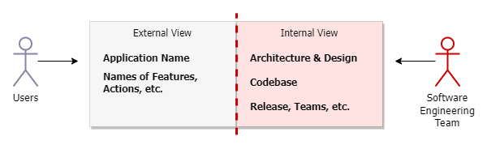
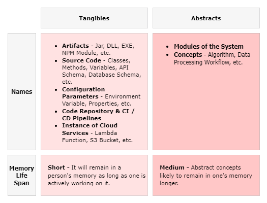
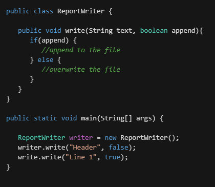
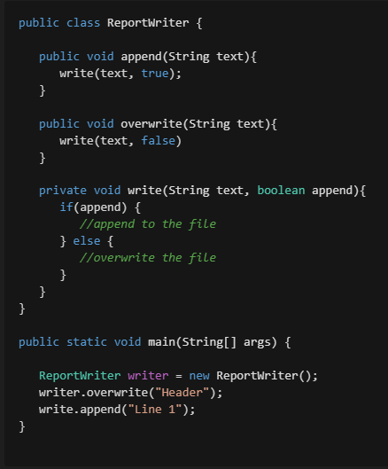
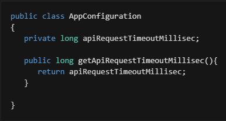

# Importance and Method of Naming in Software Engineering

* Shakespeare has written *"What is in a name? That which we call a rose. By any other name would smell as sweet."* That's obviously true but in Software Engineering (and may be in other areas also), there is actually a lot in the Name, and that makes the process of Naming of things important. That's what we will explore in this post.

* In the case of Software Engineering, A Name (or a Term) generally represents a concept, a description or a thing. Example:
   
   * "A class has a private constructor and a public static method to get the instance of the class. The class creates the its own instance and keeps it as a private static member of the class.".

   * Above description is what is popularly known as **Singleton Pattern**. *When someone reads or hear **Singleton Pattern**, it becomes clear what is meant by that. There is no need to repeat the above description of the concept*.

* What if the authors (GoF) named it **Private Constructor Single Instance Pattern** instead of Singleton Pattern. Nobody would have objected to it because it was their choice. But **Singleton Pattern** is a better name because *it precisely conveys the concept, and an additional advantage is it is easier to remember and mention*. 

* Names / Terms in a Software System can be divided in two parts.
   1. **External View**: Names exposed to the End Users.
   1. **Internal View**: Names that are relevant only for Software Engineering Team.




* Names in the **External View** are given by the Product Management and Marketing functions based on various factors. We won't be focusing on that.

* In the **Internal View**, the names used for Releases, Projects, Initiatives, Teams, etc. are temporary and are relevant only till they are in use e.g., every Android release used to have some name like Marshmallow (6.0), Oreo (8.0), etc. These are names used internally during the development. *It has no usage after the work is complete, so the names in this category are not so important from Software Engineering point of view*. 

* We will focus on other names in the **Internal View**. They can be categorized further in two buckets:

   1. **Tangibles**: Names of things you can see.
   1. **Abstracts**: Names of logical concepts, definitions, etc.



* Names in both these categories are relevant throughout the lifetime of the Software, but they have limited Memory Life Span. So these names should be **self-explanatory as much as possible** meaning they should easily convey the meaning of what they represent when someone reads them. 

* How to make names **self-explanatory**? These naming practices can help:

   1. **Reflect the details**
      * Use names that reflect as much details as possible. We will understand with few examples:
         
         1. Method Name

            * Consider following two code snippets. There is a ```ReportWriter``` class that writes to a file and it is used by the program to write a Report. Focus on the code in ```main``` method and see which one is more self-explanatory.

            * **Snippet 1**
         

            * **Snippet 2**
         

            * The code in ```main``` method of *Snippet 2* is more self-explanatory than *Snippet 1*. In *Snippet 1*, one has to find out the meaning of second boolean parameter to know what each line does. But in *Snippet 2*, each line clearly conveys its details through the name of the function.

         1. Configuration Parameter

            * When calling an external API, the timeout period is configurable in the Software. The timeout can be configured using Environment Variable. Consider following names of the Environment Variable:
               1. ```API_REQUEST_TIMEOUT```
               1. ```API_REQUEST_TIMEOUT_MILLISEC```
            *  Second is better because ```_MILLISEC``` in the name clearly conveys what is expected input. This is important because when the Software is in Production use, these values may be set by Operations team. They will not have to find out the details in the documentation - provided the documentation is up-to-date!

         1. Artifact Name

            * A Software has number of modules and each module requires some common Utility implementation like String Validations, Log Formatting, Numbers Validations, etc. There is a common library that all modules use. Consider following names for this library:
               
               1. ```utils-lib```
               1. ```common-lib```
               1. ```common-utils-lib```

            * ```common-utils-lib``` is better name because the name itself conveys (a) it is common or shared by all modules and (b) it has utility classes. Other names convey only one of these two pieces of detail.
 
         1. Algorithm Name

            * Whether a user can perform some operation or not is decided based on many rules. There is an algorithm designed for that which will be used on every API request to know whether user can perform the operation or not. 

            * Inputs to Algorithm:
               * User
               * Operation
            * Output
               * Yes or No 
            * Consider following names for the Algorithm:
               * User Permission Check
               * API Request Authorization
               * User Operation Authorization
            * *User Operation Authorization* conveys the details more accurately.

   1. **Convention**

      * Conventions are very useful in making something self-explanatory. Let's see some examples:

         1. Artifact Name

            * We have already seen in previous example *-lib* was added to the name of a Library. Similar post-fixes like *-svc* for Background Services, *-web* for Web Services, etc. can make the names of Artifacts convey more details about them.

         1. Class Name

            * In MVC pattern, it is common to have *Controller* post-fix to Class names. Similarly, using *Repository* for Classes that interact with Database is also widely used convention.

         1. Cloud Service Instance
            
            * In Cloud deployments, Environment pre-fix or post-fix can be added like *static-images-qa* (S3 Bucket), *appdb-qa* (Database), etc. Just looking at the name tells the Environment one is dealing with.

   1. **Consistency**

      * One aspect of Consistency is to **follow conventions consistently everywhere**.

      * Another important aspect is to **maintain consistency in naming across different parts**. Let's understand with an example:

         * We will continue external API request timeout example earlier in *Reflect the Details* section. There is a default configuration in the database but that can be overridden using Environment Variable. Consistency demands the following:
            * The database field should be named ```api_request_timeout_millisec```
            * Environment Variable should be ```API_REQUEST_TIMEOUT_MILLISEC```
            * Class member and getter method should also be of same name.
            
         
      * Maintaining consistency is important when working on existing Software, generally called *Legacy System*. Many people would have worked on it and many may work on it in future. So rather than starting a new trend, it is better to continue using existing naming and convention so that there is Consistency - even if it does not make sense. 

* Having **self-explanatory** names can significantly improve the **Maintainability** of the Software. It will make it easier for any new person joining the team to understand the Codebase, Deployment, Design, etc. 

* Some name will be given anyway so just paying a little attention to naming **can improve Maintainability without significant efforts**.

## Domain Driven Design

* Domain Driven Design (DDD) is an approach that advocates Software design to match the model of the business domain. 

* One of the important principles of DDD is called **Ubiquitous Language**: common terminology between business domain and the Software. To explain it in current context, DDD says same term (name) should be used throughout from business domain to the source code level. Let's see an example:

   * In most countries, individuals are required to **file** their **Income Tax Return** annually. Note the Business Domain term is **file** - not complete or submit. So everything in the Software should consistently use the same term.
      * All Design and other documentation should use the term *file* or *filing*.
      * Database table should be like```income_tax_return_filing```
      * Classes should be like ```IncomeTaxReturnFilingController```, ```IncomeTaxReturnFilingRepository```  
      * Method name should use *file* or *filing*.


As we can see, there is a lot in the name. Please share your feedback in comments.


```java
public class AppConfiguration
{
   private long apiRequestTimeoutMillisec;

   public long getApiRequestTimeoutMillisec(){
      return apiRequestTimeoutMillisec;
   }

}
```