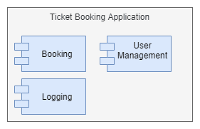
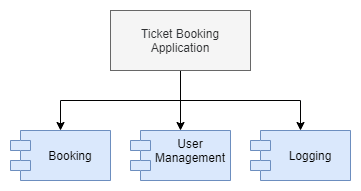
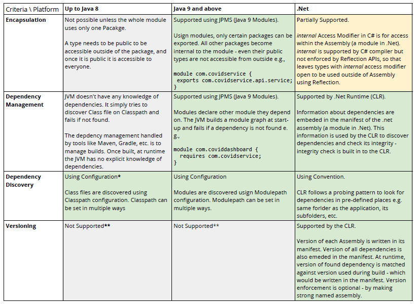

We’ll explore modularity in Java and .Net platforms, but before let’s first spend a little time on understanding what and why of modularity.

# What is a Module?

Dictionary say a module is *“one of a set of separate parts that, when combined, form a complete whole”*

So a module needs to have two main characteristics:

* Provide one or more related set of services via a standard interface — having standard interface would make a module reusable and replaceable
* Hide implementation details from the consumers of the services

# What is Modular thinking?

Modular thinking would involve the following:

1. Break down the problem in small parts i.e. modules. Each part would satisfy the following:
  * Each module is focused on one or more related services \ functions
  * Services are exposed using a standard interface
  * Each module can potentially be used in any place where the same services are required
1. Create the final solution by composing different modules together

Almost everything around us is an example of modular thinking e.g. Automobiles, Personal Computer, Electronic Devices, etc.

Most of today’s software are built using tools and platforms that are built in modular approach e.g., Spring Framework and .Net Framework, two very popular frameworks in Java and .Net, are both modular in nature. Both have number of modules (libraries) and those modules can be used (or reused!) in solutions for different problems.

# But why Modularity?

What do we gain from modular approach to the solution? I think the following three are the primary benefits:

1. *Reuse* : Same module can be reused elsewhere, saving time and effort

1. *Stability*: A change in the system is reduced to small area (implementation is hidden from consumers) and that allows more complete testing in shorter time.

1. *Parallel Execution*: Multiple modules can be developed by different teams in parallel and final solution built by composing those modules. Saving time to market.

# Logical & Physical Modules

In software applications, logical grouping of functions and services is done to create a modular design. This would be an outcome of the application of Software Architecture principles on the problem domain e.g., the following modules may be identified for a Ticket Booking application, each focused on a specific area of the solution.

However, that’s still a design of the software application. Working software (application binaries) they can be in one of the two forms shown below:

a. an executable file containing all the modules. Here, the modules may internally be organized separately in the source tree of the application, but physically they all are in one executable file produced by building the application.

b. each module is a library and the application is using the libraries. Libraries are built and released separately from the main Application.

Option (b) is the modular approach that we all are familiar with and use everyday. Option (b) gives all the benefits of modularity listed above.

*It is said that Unit of Release is the Unit of Reuse. There is no scope for reuse in Option (a).*

# Required Platform Capabilities

To support the modularity of option (b), a platform needs to have at least the following capabilities:

1. *Encapsulation* : Encapsulation at module level. This is to ensure consumer uses only standard public interface and the details are hidden. Consumers cannot build dependency on “details” so that details can change without breaking anything e.g., in a logging library, *com.mylogger.api.Logger* is public interface and *com.mylogger.service.impl.FileLogger* is the class implementing logging to file. Users of logging library should not have access to *FileLogger* so that *FileLogger* can change without breaking any dependent application.

1. *Dependency Management* : Since each module would also depend on some other module, there needs to be a way for each module to declare its dependencies.

1. *Dependency Discovery* : Once a module has declared its dependencies, the platform needs to discover those dependencies (modules i.e. libraries) at runtime, load them and make them available.

1. *Versioning* : Versioning of modules is required to let each module evolve independently without breaking other modules depending on it.

# Comparison of Java and .Net platforms

Let’s compare Java and .Net on these parameters

**The package structure at runtime is used to locate .class files. JVM would look for exact same directory structure as the package name e.g. all types under “com.covidservice.api.service” should be found under “com/covidservice/api/service” on the Classpath JARs. So a package is not really treated as a dependency by JVM. JVM searches for .Class file when it has to create a new Class or Instance — this is different from how dependencies are managed in Java 9 and .Net.*

***Java does not support versioning at JVM layer. The versions of JARs are maintained using naming convention i.e. including version in JAR filenames like spring-web-1.0.0-RELEASE.jar. If you have wrong version on Classpath or Modulepath, JVM would use that as long as the .Class file (Java 8) or Module (Java 9) are found.*

# OSGi — Dynamic module system for Java

OSGi is an industry alliance for *“a vendor-independent, standards-based approach to modularizing Java software applications and infrastructure”*. OSGi was formed in late 1990s.

There are many implementations of OSGi specifications like Apache Felix, Eclipise Equinox, etc.

OSGi component system is used to build Eclipse IDE, JBoss, WebLogic, etc.

# Summary

Modular architecture is a necessity once complexity and scope grows beyond certain point. It is difficult to introduce modularity at a later stage so better to do it from beginning.

Modular design can be created by applying principles of Software Architecture, but platforms used to build the software need to support modular architecture. Java 9 and .Net are more capable than Java 8 — for reasons explained above — to enforce modularity