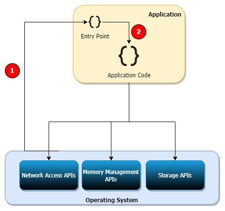
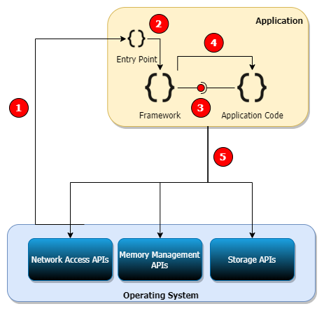
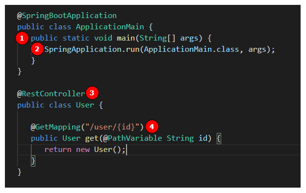

# Difference between Platform and Framework

## What is Platform? 

We will start with few words on [Platform Business](https://www2.deloitte.com/ch/en/pages/innovation/articles/platform-business-model-explained.html) to avoid confusion with main focus area of this write-up.

**Platform Business Model**

* A *[Platform Business](https://www2.deloitte.com/ch/en/pages/innovation/articles/platform-business-model-explained.html)* works as a **platform** for a network of people / participants to carry out some activity. Most platform business models are supported by technology infrastructure. eBay, Shopify, Facebook, Uber, etc. are all examples of [Platform Business Model]((https://www2.deloitte.com/ch/en/pages/innovation/articles/platform-business-model-explained.html)).

* This is not the focus of this article.

**Platform in Software Development**

* A platform is a sytem that allows programs to be built and run on it. Platform provides services to make it easy to write a program. 

* Operating Systems Linux, Windows, Android, etc. are platforms. They allow programs to be built and run, and they provide services for storage, memory management, network access, etc. via their APIs.

* Platform would need an Entry Point to run the program: ```main``` method or similar mechanism. Platform calls the Entry Point and transfers control to the program. Then program has the control and it can do whatever it wishes using the services of the platform.




1. When program is run, the platform execution service will locate the Entry Point and start program execution.
2. From Entry Point onwards the Application program has the control of execution. *Platform does not enforce anything*. Application may use the services of the platform.

* So a platform is an abstraction layer. It hides implementation details of common services and allows Applications built on the platform to focus on solving business problems.

* Are Java, NodeJs, .Net, etc. also Platforms? 

&nbsp;&nbsp;&nbsp;&nbsp;&nbsp;&nbsp;&nbsp;&nbsp;&nbsp;&nbsp;Yes, they are platforms. They allow other programs to be built and run, and they provide services to simplify Application development e.g., file I/O operations using APIs in Java or .Net are much more easier than using OS APIs directly. Most of them are now Platform-independent Platforms because they can work on any Operating System.

## What is Framework?

* Framework gives a pre-defined structure to the application. 

* Frameworks are also an abstraction layer. They also implement repetitive tasks and allow Applications to focus only on their problems. But they are different from Platform. The following diagrams will make it clear.



**Sample Code**

Code is in Java and SpringBoot but it should be easy to understand as other frameworks also have similar mechanism.




1. Platform calls the Entry Point to start Application.
1. The Entry Point then loads the Framework. Frameworks are hosted within an Application only.
1. The Framework goes through a **Discovery** process to find its **Plugins**
   * ```User``` class is a **Plugin** because it it annotated with ```@RestController```. This tells Spring Framework that this is a Plugin. 
      * In some case, the plug-in may be indentified by implementation of an interface. Interface is declared by the Framework. 
   * The Spring Framework discovered that there is a Plugin ```User``` that should be called when there is API request with HTTP GET verb and URL path matching ```/user/{id}``` pattern.
1. When there is an API request with URL ```http://localhost:8080/user/AARE2212```, Spring will call the ```get``` method.
5. The Framework and the Application both may use Platform services.

* Frameworks implement **[Inversion of Control](https://www.theserverside.com/definition/inversion-of-control-IoC)** pattern. It is called **[Inversion of Control](https://www.theserverside.com/definition/inversion-of-control-IoC)** because
   * the control of execution is always with the Framework
   * Plugin declares its intent when it would like to act so that the Framework can pass on control of execution by calling the Plugin.
   * Framework calls the Plugin when events that Plugin is interested in occur e.g. API request  ```HTTP GET /user/{id}```. *If an event that the Plugin is interested in doesn’t occur, Framework doesn’t call the Plugin*.
   * Framework takes care of common repetitive tasks and Application focuses only core Domain / Business logic. 

<br />

* **As the Application written on a Platform grows in size and complexity, it requires Frameworks to have better Maintainability and Productivity - make changes faster with less effort.**

* Sometimes the concept of Framework can also be applied for the Application logic. Example:

   * We need to write an API that can be used to upload different types of CSV files. On upload of the file, data in the CSV is stored in different tables. 

   * In the following sample code, ```FileProcessController``` controls the whole processing and performs common tasks during the file processing. It calls Plugins to do the actual processing a File of type supported by the Plugin is in the request.

   * Adding support for a new type of file requires writing in the Plugin i.e. a Class implementing interface ```IFileProcessor```
   
```Java
    public class FileProcessRequest {
        private String type;
        private String path;
    }

    //Plugins will implement this interface to declare they are a plugin
    public interface IFileProcessor {
        FileProcessResponse process(FileProcessRequest request);
    }

    //A file processor implements interface and declares the File Type it supports
    @SupportedFileType("SALES")
    public class SalesFileProcessor implements IFileProcessor {

        @Override
        public FileProcessResponse process(Framework.FileProcessRequest request) {
            //perform some domain logic here
            return null;
        }
    }
    
    //Controller that controls the flow of whole workflow and performs common tasks
    //required for all types of files. 
    public class FileProcessController {

        public FileProcessResponse process(FileProcessRequest request) {

            scanFile(request);
            validateFile(request);
            IFileProcessor processor = getProcessor(request);
            if(processor != null) {
                return processor.process(request);
            } else {
                //log error and send notification
            }

            return null;
        }
    }
```

## Platform-as-a-Service (PaaS)

* Based on what we discussed above, PaaS can be thought of as Platform to quickly build and run distributed Applications.

* PaaS offerings in Cloud provide various Compute, Storage, Networking, etc. service via APIs. An Application can be built and run using these services. If we take AWS for example:

   * AWS Lambda - Compute Service to run program
   * RDS - Database to store data and run DB Server
   * S3 - Storage
