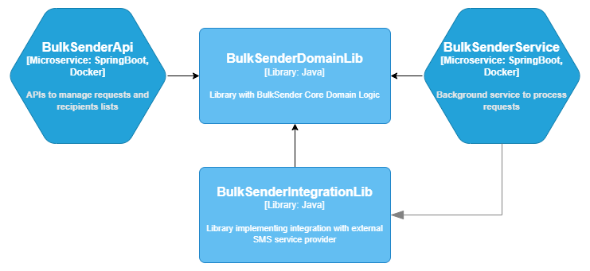
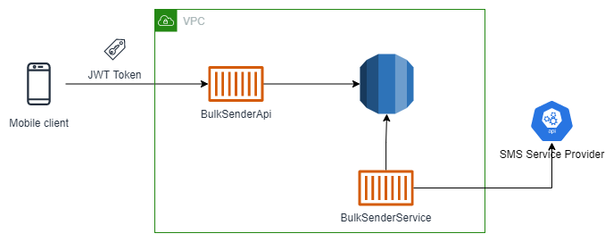
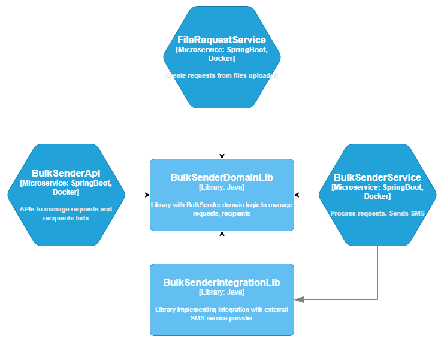
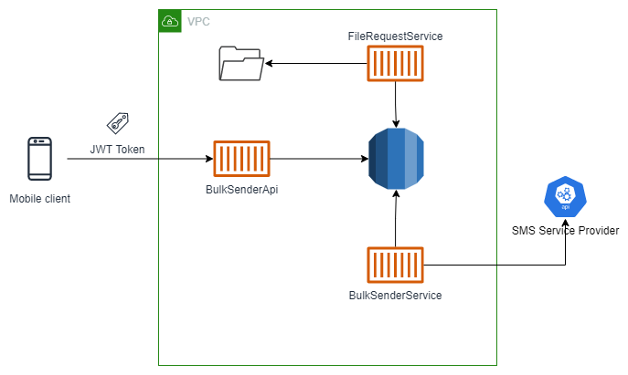

# Software Architecture Basics: What, How & Why

Architecture and Design are widely used terms in software engineering. Every software has some architecture. But what is Software Architecture and why is it given so much importance? Or is it really important? The goal of this write-up is to gain a better understanding with help of some examples.

Let's start with basics.

# What is Software Architecture?

There are many definitions of Software Architecture. 

[Wikipedia](https://en.wikipedia.org/wiki/Software_architecture) says *"Software architecture refers to the fundamental structures of a software system and the discipline of creating such structures and systems"*

[Martin Fowler](https://martinfowler.com/architecture/) has defined architecture as *"the decisions you wish you could get right early in a project* and *Architecture is about the important stuff. Whatever that is."*

There will be many more definitions. They all are true, but I have found the description in [Clean Architecture](https://www.amazon.com/Clean-Architecture-Craftsmans-Software-Structure/dp/0134494164) by [Uncle Bob](http://cleancoder.com/files/about.md) easier to start understanding the concept. Here is my explanation based on that:

There are two aspects (or "value" as Uncle Bob says) of a software:

1. **Behaviour**: the reason for the software to exist like an email client to send and receive emails, a calculator to perform calculations, etc.
1. **Shape / Structure**: it is the foundation on which features (that provide behaviour) are built.

Behaviours will change with time as the software needs to adapt to growing and changing user needs. *A good architecture will provide shape / structure that makes the evolution of behaviours easier, faster and less expensive*.

*Architecture's goals are to make it easy to understand (for a developer), develop, maintain (change), deploy and operate a software.*

A lot has been said in few lines! It will become clear as we go further.

# What is Design?

The difference between Software Architecture and Design is confusing because they both are mixed and sometimes there is no clear differentiation. But still let's try to understand what is called Design.

Architecture is about shape / structure which is fundamental and difficult to change once done. Design is things that are built on the foundation and things that can be changed with relatively less difficultly.

Let's try to understand with an example:

* An application has default system settings and user settings. User settings override default system settings. Default system settings are configurable via database and environment variables. Environment variables take priority over database config.
* To implement this requires deciding many things like:
   1. Configuration Parameter naming standardization
   1. Database schema to store configuration
   1. APIs / Interface used by other parts of system to fetch and update configuration
   1. Classes and their relationships implementing the behaviour required for configurations
* #1, #2 and #3 are things that are more expensive to change once implemented and deployed. So they are **Architectural Decisions**. #4 can be changed relatively easily even after implementation so it can be considered a **Design Decision**.

# Process of Architecting

* *Architecture* in a way is **a set of decisions taken in a given scenario**.
* Most of the times, something can be done in multiple ways, but the *Architecture* selects one option from that. That **choice of one option** is the **Architectural Decision**. E.g.,
   * There are multiple protocols to build an API: REST, GraphQL, SOAP.
   * The decision to use GraphQL is the Architectural Decision.
* So next questions should be how are these decisions made? Inputs to Architectural Decision Making:
   1. Requirements 
   1. Architectural Characteristics (AC) (or Non-Functional Requirements) derived based on requirements and business domain. E.g.,
      * For a stock trading platform, Performance and Reliability are important ACs.
      * For a news aggregation portal, Responsiveness is important - meaning immediately load first 5 stories and load remaining stories asynchronously, so user doesn't have to wait longer to start consuming the content.
   1. Implicit ACs: things that nobody will ask for but always expect like Security, Maintainability, etc.
   1. Available resources: budget (cost), skills and time. Example:
      * It is identified that writing a serverless function (AWS Lambda) is good choice to perform some background tasks.
      * NodeJS may be the right choice to write a serverless function but do we have skills in the team to build it within the time we have to release the feature?
      * We don't have NodeJS developers but we have Java developers, so is it possible to use Java to write a serverless function?
* Most Architectural Decisions are trade-offs. They have some bad outcomes, but still it may be *right decision* for the given circumstances. If we can live with it, it is easier otherwise we have to try to mitigate its effects. E.g.,
   * Writing a serverless function (AWS Lambda) in Java has problem of [Cold Start](https://mikhail.io/serverless/coldstarts/aws/) because JVM takes at least few hundred milliseconds to start-up.
   * So we have following options.Each has its negative impact but we have to select the one *right for current circumstances*:
      
      1. Since the functions will be used in background processing so we decide to live with few milliseconds of performance hit for now and revisit this later if it becomes a serious issue.
      1. In case we cannot afford performance hit, we have to provision at least 1 (or more depending on load) Lambda instance to be active all the time. But this will add to Cost. 
      1. Train a developer on NodeJS and then write function in NodeJS. But this will impact timeline.
      1. Find an alternate to serverless function.
* Output of Architecting:
   * Documentation with reasoning and decisions. It can be diagrams, write-ups, specs, etc.
   * Common artefacts:
      * Components and relationships between them
      * Shared libraries and interfaces
      * Deployment view 
      * Security scheme - authentication, authorization, secrets management
      * API Schema
      * DB Schema
      * Guidelines like naming conventions, exception handling practices, logging conventions, etc. 

# Case Study

Let's walkthrough the journey of an application to understand these concepts with an example.

*Product Manager (PM)* and *Engineering Team (ET)* discuss requirements.

## Stage: Building MVP

*PM*: We need to build a mobile app that will allow users to send SMS in bulk and check the status of the delivery. Users can manage list of recipients by uploading a CSV or manage via the App.

*ET*: Do we need to send SMS for each request immediately on receiving request? 

*PM*: No, we don't have to do that now. We put the request in queue and we process requests one by one. Expectation is that we will process it at least within an hour of user submitting the request. This is MVP so we will keep it simple.

*ET*: How will the user on-board and sign-in?

*PM*: They will use their mobile number. We will send an OTP and verify the number.

*ET* comes up with an architecture for MVP and produces artefacts.

**Components**

**Deployment**

> The architecting process would produce other artefacts like Database Schema, Security Scheme, etc., but we are only including things relevant to the discussion.

## 1 month after MVP release

*PM*: We have got an enterprise customer who is interested in using our services. 

*ET*: That's great!

*PM*: They right now use another provider. They generate a CSV file with requests at scheduled frequency. This file is uploaded to a shared location and the service provider processes the file to send messages.They are interested in trying out our service if they do not have to make any changes to their implementation. Can we make it work?

*ET*: It should be possible..let us think about it.

*ET* comes up with a solution that can be implemented quickly.

**Components**

A new component *FileRequestService* is added that will read files and create requests from that. This was possible because core domain logic to manage requests, recipients, etc. was implemented in *BulkSenderDomainLib* so it can be re-used easily from any part of the system. 

**Deployment**

**What went well?**

Breaking down system in modules allowed a new requirement to be accommodated very easily and quickly. This kind of requirement was not expected during MVP, but the Architecture was able to handle it.

## 6 months after MVP

*PM*: There is lot of interest for our service. Customers really want to use it but we are getting lot of complaints that the messages are delivered after hours. 

*ET*: Because we are getting lot of requests...

*PM*: But we need to fix this.In fact, we also want to introduce a quick delivery paid plan. We think we will get customers ready to pay for an immediate delivery commitment.

*ET*: That's going to require a lot of work.. 

*PM*: Why..??

*ET*: We kept it _simple_ for the MVP. We did not provision for scaling for such load.

*PM*: We better do it right now!

**What went wrong?**

***ET* did not identify Scalability as AC\NFR in request processing in the original MVP architecture**. That is now causing a problem when the solution needs to scale quickly. This lapse can be costly because it can either force a half-baked solution in hurry or delay business plans.

> **Should *ET* always design for scale even when they don't know what is going to be the scale?**
>
> Its a *trade-off*:
>
> a. Building for scalability will add complexity to the solution meaning more time to release. 
>
> b. On the other hand, there may be kind of problem we just went to through.
>
> *There is no right or wrong approach*. If MVP doesn't work, doing a quick release saved effort so (b) would be the right thing. 
>
> That's where the **Architectural Decision Making** is required to find a balance between *Long Term Goals* and *Short-term Needs* working with all stakeholders.

# In the end..

There is no universally accepted definition or scope of Software Architecture. It also evolves continuously with change in technology e.g., Cloud has added lot of new possibilities that widens the scope of Architecture. We have tried to understand **what can be considered Software Architecture**. And now if you go back and read all definitions of Software Architecture, you may understand them better.

Instead of exactly defining what is Software Architecture, it is important get a good understanding of **Process of Architecting** and **Importance of making good architecture and design decisions**.

This is a vast topic with various perspectives. Lot of the insights come with experience. I have presented my understanding. Please comment if there is anything you would like to add (or remove too :)). Thanks for reading!

# References

[Clean Architecture](https://www.amazon.com/Clean-Architecture-Craftsmans-Software-Structure/dp/0134494164) by Robert C. Martin

[Fundamentals of Software Architecture: An Engineering Approach](https://www.amazon.in/Fundamentals-Software-Architecture-Engineering-Approach-ebook/dp/B0849MPK73/ref=sr_1_3?crid=271BK9XDEO9DN&keywords=software+architecture&qid=1664192629&qu=eyJxc2MiOiI0LjU2IiwicXNhIjoiMy45NiIsInFzcCI6IjMuODAifQ%3D%3D&sprefix=%2Caps%2C1173&sr=8-3) by Mark Richards, Neal Foad

[C4 Model](https://c4model.com/) by Simon Brown - Component Diagram uses C4 template