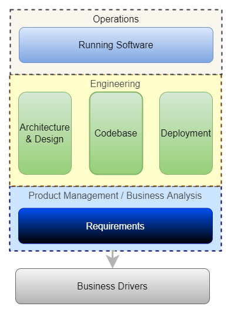
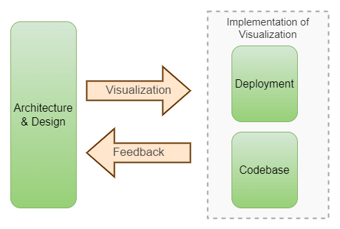
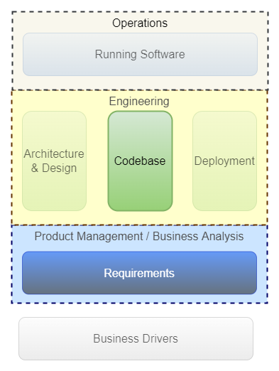
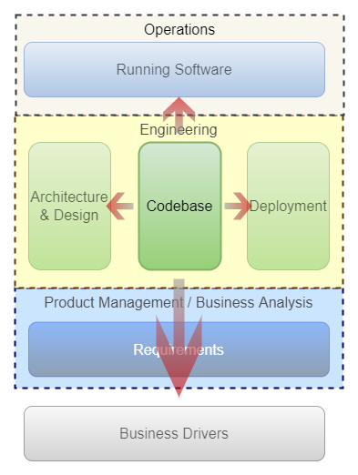
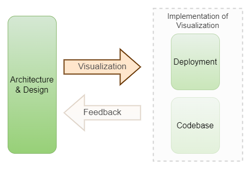
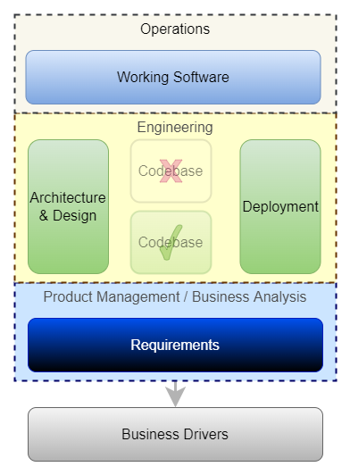
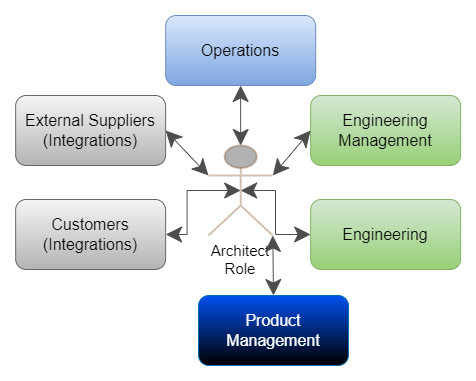

# Software Architecture Basics: From Developer to Software Architect

* In Part 1 - [Software Architecture Basics: What, How & Why](../software-arch-overview/software-arch-overview.md), we discussed what is Software Architecture and the process of Architecting.
Here, we will discuss the journey from a Developer to an Architect Role. 

* As a Developer grows in experience and moves in to an Architect role, there are mainly two types of capabilities required:

   1. Depth and Breadth in Software Engineering

   1. Problem Solving in a Group

* Before going further, some clarifications on scope of the discussion:

    * We are discussing **Architect Role**: not a person with an *Architect* designation. Role may be performed by one or more persons. It may be having different designations in different organizations. It is also possible that a Developer takes on the Architect Role as and when required. In any case, the person doing the **Architect Role** will work on taking Architectural and Design decisions as discussed in [Software Architecture Basics: What, How & Why](../software-arch-overview/software-arch-overview.md)

    * A Software Solution may have a Web Portal, a Mobile App, and APIs in the backend. The concepts discussed here are generic and will apply to all areas.  

## Depth and Breadth in Software Engineering

* Software Engineering is the development, operation and maintenance of a Software using discplined and systematic approach.

* We will first understand different Functions and main Components of those Functions in a Software Engineering. 

* We will go through each starting from the bottom.

**Business Drivers**

* Business Drivers are **facts** derived from three aspects:

    1. **Objective**: Every Software tries to solve some problem in the physical world, or offer some services to its users. 

    1. **Industry Background**: A Software operates in some background like compliance requirements, industry trends, marketplace competition, etc.

    1. **Commercial**: A Software needs to ultimately help to either **increase revenue** and / or **reduce cost** to make sure the business is viable.

**Product Management / Business Analysis**   

* Requirements for the Software are generated based on the clarity from the **Business Drivers** and other inputs like User Research, etc.
   
**Engineering**

* *Engineering is the process of converting the requirements in to reality i.e. a Working Software.*
      
* Engineering has three main components:

   1. **Architecture & Design**

      * Architecture & Design is the **Visualization** of how the Requirements will be converted in to a Working Software.

   1. **Codebase**

      * Codebase is the **implementation** of the Requirements and the Architecture & Design.
      * Codebase is the most important asset but it is not good enough to have a Working Software.

   1. **Deployment**

      * A Software would have some pre-requisites for it to run like Operating System, Runtime (like JVM, Node, etc.), Configuration, etc., which is its **Environment**. Deployment allows the Codebase to **run in an Environment** and let users use the Software.

* The relationship between the three components can be described in the following way:

* Codebase and Deployment together form the **implementation of the Architecture & Design**. The **implementation provides feedback** so that improvements can be made to the future designs.

**Operations**

* Codebase deployed in an Environment becomes a Working Software available to the End Users. As with everything in life, the deployed Software and the Environment will run in to problems from time to time, so there will be need for monitoring and management to keep it running.

Now with this understanding, we will try to understand the journey from a **Developer** to an **Architect Role**.

### Developer Role

* A Developer will mostly focus on the **Codebase** and **parts of the Requirements** that are relevant to the work.

* It does not mean no knowledge about other components like Architecture, Deployment, etc., but the primary focus is on implementing the designs and requirements.

### Architect Role

* Architect Role requires expanding the horizon in all directions and gain an understanding of all other components as shown in the diagram.

* Obvious question would be "Why?". So let's go through each one:

   1. **Architecture & Design**

      * This is straightforward. Architect Role will require good understanding of the Architecture & Design as discussed in [Software Architecture Basics: What, How & Why](../software-arch-overview/software-arch-overview.md)

   1. **Deployment**

      * Deployment is part of the implementation of Architecture - see diagram above.

      * Deployment involves the following:

        1. Setting up the Environment
        1. Creating a build from the Codebase
        1. Installing the build
        1. Setting the Configurations for target Environment
      
      * **A small mistake in the Deployment of a release can create serious problems, and damage all the good work done in Architecture and Codebase.**
       
      * As complexity and size of a Software grows, Deployment itself becomes complex and very critical. Errors are likely in a Manual deployment procedure. That's why today all these four aspects are generally automated (CI\CD and Infra-as-Code) fully or partially.
       
      * Having a good understanding of how Codebase is made to run in an Environment is required for Architectural and Design decisions.

   1. **Operations**

      * There will always be problems once a Software is deployed and is in use. Example:
          
         * Emails are not going out. Someone needs to troubleshoot and isolate the problem from different possibilities: (a) the external email service down, (b) logical error in the program (bug) resulting in error, (c) wrong configuration, etc. and so on.
       
         * First, "Email not going out" needs to be identified, so **monitoring** is required and then **ability to troubleshoot** via logs, tracing in database, etc. is required.

      * Having a good understanding of the challenges of Operations will allow designing solutions for ease of Operations.

   1. **Business Drivers**

      * Business Drivers are the foundation on which everything is built. Having a good understanding of it will allow building flexibility in Architecture. Example:

         * We need to build a SaaS based diagramming tool.
         
         * In the beginning, it will be free. Later paid plans will be introduced with feature restrictions on free usage.

         * Feature restrictions for users based on their subscription is a fundamental implementation. It will be good  if it is designed and implemented from start instead of doing it when the Business wants to introduce paid plans.  

      * One of the steps in [Process of Architecting](../software-arch-overview/software-arch-overview.md) is identifying Architectural Characteristics (AC) / Non-functional Requirements. Some of these AC are derived from Business Drivers like compliance requirements, scale requirements, etc.

**Association with Codebase**

* As the focus moves to other areas, association with the Codebase may go down. But it is important for a person in an Architect Role to be **at least familiar and comfortable with the Codebase. Otherwise, the feedback loop is broken**. 

* The Codebase may become less highlighted but should never disappear from the view.

So far we have discussed what and why of **Depth and Breadth in Software Engineering**. Now we will understand the second capability required in the Architect Role: **Problem Solving in a Group**.

## Problem Solving in a Group

* Most Software Engineering efforts require a team to perform different functions and deliver the output. **A person in an Architect Role needs to have appreciation for teamwork and ability to work in a team**.

* A person in an Architect Role may have to interact with one or more of the following stakeholders:

* Let's go through each one to understand the nature of interactions:

   * **External Suppliers**
      
       * Integrating with external service providers is common nowadays.
      
       * Every integration will bring common challenges like API contracts, security, error handling, etc. The Architect Role may have to get involved in these conversations.
   
   * **Customers**
      
       * In some cases, Customers may integrate with our system and that means the Architect Role may be required to participate in some conversations around usual integration challenges discussed above.

   * **Operations**
      
      * It is important to understand the challenges of Operations so that improvements can be done.

      * Sometimes it may be better to get some Architecture & Design choices reviewed by the Operations before implementing. Example:

         * A new feature requires uploading a File.

         * This is a potential security issue from the Operations point of view because it may bring something malicious in the Environment.
         
         * In such cases, making Operations part of the design is beneficial.

   * **Engineering Team**

      * Collaborating for the design, working with Engineers to resolve implementation issues, and getting feedback on challenges faced by them. 

   * **Engineering Management**

      * Participate in planning and prioritization. 

   * **Product Management**
   
      * Technical inputs for roadmap and prioritization.
      * Understanding the Requirements and the Business Drivers.

* As you can see, all stakeholders have different needs and priorities, so a person in an Architect Role should try to develop following capabilities:

   1. **Ability to listen and take feedback**
      
      * At high level, the Architect Role's main objective is to convert Requirements or Feedback in to designs that can be implemented. 
      
      * *Without this skill, it will be very difficult to create designs that meet the expectations of different stakeholders*.

   1. **Convey / Articulate views clearly**

      * The key is to be able to convey your views to different types of stakeholders e.g., conveying a design to an Engineer is different than explaining Security requirements to a Customer - former may require going in to details and the latter may require just providing summary / enough details. That change in style is required to be effective.
      
      * Using diagrams and maintaining good docs can be useful here.

   1. **Balancing conflicting needs - Long Term vs Short Term**

      * Sometimes doing something in the "right way" (Engineering correctness for long term) will require more time than Business priorities will allow.

      * The Architect Role has few options in this case:
         
         1. Present the pros and cons, and convince the management to give more time to do it the "right way".
         
         1. Find some way to achieve both objectives - Engineering Correctness and timelines.
         
         1. Find some compromise solution that will satisfy timelines with reduced damage to long term Engineering objectives.

      * This is a very common scenario and ability to work out some solution that balances both needs will be of great value to all stakeholders. 

## In the end...

* Does everyone MUST have these capabilities to do well in an Architect Role? 

   * No. Exact needs will change in each scenario because a lot will also depend on the complexity of the system, team, etc.

* What is the point of all this if it is not required to perform an Architect Role? 

   * We have tried to develop an understanding of what will help to be more effective in an Architect Role in general. Developing all the capabilities discussed here will require conscious efforts and time. It is a continuous process. There is no end to it because there is always something new to learn and improve as you work on different problems.

Thanks for reading if you have reached this far.. :) Please share your feedback in comments.