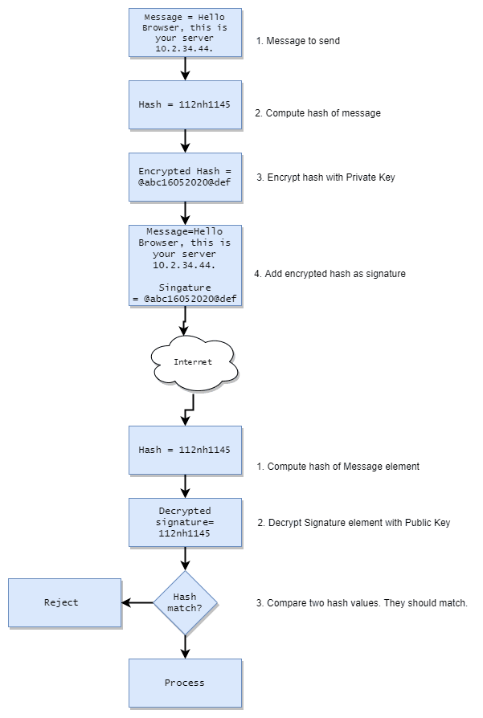

We'll cover the following building blocks:

1. Secure communication
1. Authorization

# Secure Communication

TLS \ HTTPS is the means for secure communication between a service and a client. However, for TLS to work, the following are required:

1. Cryptography
1. Cryptographic Hash Function
1. A way to exchange cryptographic keys - done using X.509 certificates
1. Authenticating certificates

Once all these things are in place, TLS protocol can establish a secure communication channel. We'll go through these one by one.

# Cryptography - Encryption & Decryption

Cryptography is process of converting plain text in to unintelligible text and vice versa. Encryption converts plain text to unintelligible text and decryption does the revers of it.

Cryptographic algorithms can be divided in to two types: Symmetric Key and Asymmetric Key. 

| Criteria | Symmetric Key | Asymmetric Key |
|---|-----------------------------------------|-----------------------------------|
| Keys | Same key is used to encrypt and decrypt | A key pair private key-public key is used.   Private key is not shared with anyone. Public key shared with everyone.   Data encrypted with private key can be decrypted ONLY with public key and vice versa |
| Algorithms | AES 256 | RSA |
   
See [How Symmetric Key and Asymmetric Key cryptography works] (https://howhttps.works/the-keys/) explained in very simple terms.

# Hashing

* Hash functions are algorithms that take a text of any length and produce a fixed length text. The output is same as long as the input is same e.g., Input = "This is test" and Output of Hash function = "112345", it will always give this output for same input.

* The reverse is not possible. "112345" cannot be converted to "This is test"

* Passwords are stored as hash values so that they can only be compared (hash of entered password = hash stored in database) but cannot be recovered by anyone.

* SHA family of algorithms for hashing.

# X.509 Certificate

X.509 certificates are used to associate a public key to the entity that owns it - it can be an organization, a website, or an individual.

Clicking on padlock in any browser shows the X.509 certificate associated with the domain. It has public key and many other information.

Certificates are issued by Certificate Authorities (CA) who are trusted by browsers. In Chrome, Go to Settings > Privacy and Security > More > Manage Certificates, to see root and intermediate CAs trusted by the browser.

# Digital Signatures

Digital Signatures ensure the following:

1. Integrity of message - message is as it was sent
2. Authenticity of message - message has come from original source
3. Non-repudiation - sender cannot deny sending the message

Digital Signatures are not limited to internet but it is easy to understand it in the context of traffic on internet. This is how it will work:

Let's see how the three objectives are met:

1. Integrity - if hash values match, message was not modified in transit
1. Authenticity - signature decrypted with public key and hash values match, so the signature was generated with private key.
1. Non-repudiation - if #1 and #2 are met, sender cannot deny sending it because otherwise both #1 and #2 would fail.

X.509 certificates are signed by the CA and browser validate the signatures in similar way e.g., 

1. *SecureOne, Inc* is a root CA and trusted in chrome. It has issued a X.509 certificate to *yourapp.co*
1. when you open *yourapp.co* in browser, browser gets X.509 certificate from *yourapp.co* server.
1. It tries to validate the certificate by validating its signature - it has public key of the root CA in its store.

See [How the X.509 certificates are validated](https://howhttps.works/certificate-authorities/) explained in very simple way.

# Transport Layer Security (TLS)

TLS builds on everything we discussed above. Its predecessor is SSL (Secure Socket Layer). TLS is meant for a secure connection at Layer 4 \ transport layer. 

HTTPS is HTTP on TLS. TLS 1.2 is the latest version supported by browsers.

See [TLS and HTTPS](https://howhttps.works/https-ssl-tls-differences/) explained in simple terms.

Whenever you open a website in browser, underneath a process happens called TLS Handshake which establishes a secure channel between browser and server. See [How certificates play a crucial role in securing traffic on internet](https://howhttps.works/the-handshake/) for simple explanation of the handshake.

# Authentication

Authentication is the process of validating whether an entity is who it claims to be e.g., when you login to Gmail with youremail@gmail.com, "youremail@gmail.com" is the entity and Gmail validates that by matching the password you provide with what is stored in its database.

Credentials are required to validate the identity. There are three types of credentials that are generally used:

1. What user **knows** e.g., password
1. What user **possesses** e.g., OTP on mobile, link in email, etc.
1. What user **is** e.g., fingerprint

When a combination of these types is used, it is called Two-Factor \ Multi-Factor Authentication. This is decided based on criticality and usability of application.

# Authorization

Once authenticated, authorization is the process of evaluating whether the authenticated identity can perform an action or not.

For most applications, real need is Authorization but it is not possible without Authentication.

Now that you have understood the basics, read [Software Security Overview](../software-security-overview/software-security-overview.md) to get an overall view of building a secure software.

