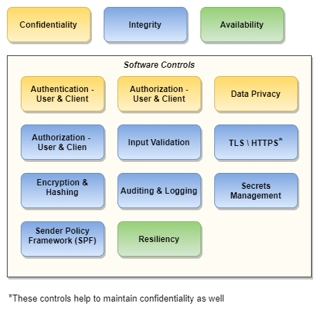
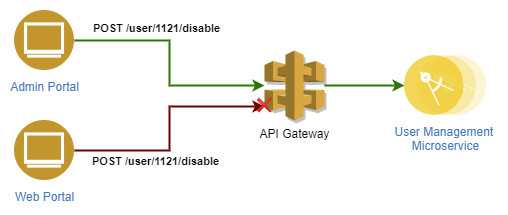

# Introduction

As a developer, when you think of security, what comes to your mind? Is it clear what are different aspects that need to be handled to make your software secure? And why you need to do that?

*Objective of this post is to provide that view and articulate what controls should be in place and how*. Details of how to apply those controls would require separate posts and are not covered here - and lot of content is available on the web. 

# What is Software Security?

Security implementation of a software application can be classified in two parts:

1. Pre-deployment - building a secure software
1. Post-deployment - security of the environment where software is running

Software Security is pre-deployment. It is the process of identifying risks and building controls (or *Countermeasures* as it is called in security terminology) in the software itself while it is being built. 

Software Security is the focus of this post. We will see controls commonly used and what risks they mitigate.

For more details on the topic, see [What is Software Security](https://www.synopsys.com/blogs/software-security/software-security/) by [Gary McGrow](https://www.garymcgraw.com/)

# Nature of security

A software application would generally have two aspects:

a. Services that provide some functionality
a. Data generated and consumed by the services

Security can be defined as *defending services and data from unauthorized and malicious usage at all times*.

*Defending* is the key word here. Defense literally means *an act of resisting an attack*. That means attacks can happen anytime and any number of times, and we need to keep protecting the system from these attacks. 

That's what makes security of a software application very difficult because to it is not easy to to get it right all the time. 

Also, there is no room for error. One incident may be enough to destroy the reputation and business built over the years.

# How to approach security?

The following is the minimum that should be done:

1. Follow industry best practices rather than inventing our own mechanisms. These best practices have come out of years of learning and it is better to rely on that tried and tested knowledge.

1. Secure by design: make security a criteria in all aspects like Requirements, Architecture, DevOps, Engineering Practices like code reviews, unit testing, application testing, etc. This would ensure that everything is built secure by default - security is not thought of after delivering the functionality which happens on many projects.

# What would make a software secure?

CIA triad (or AIC triad) is commonly used for Information Security, but it also helps to better understand security in general. A software should have the following properties to be secure:

1. **Confidentiality**: Authorized access to services and data e.g., to view your GMail mailbox and send emails, you must successfully login to GMail.

1. **Integrity**: Integrity and authenticity of data presented (in transit) and stored (at rest) e.g., the emails shown by GMail are exactly how they were sent by the sender and content is same as that stored on GMail servers.

1. **Availability**: Software is always available to all authorized users for all legitimate use-cases e.g., GMail services are always available to its users.

# Design Principles

See [Secure Design Principles](https://github.com/OWASP/DevGuide/blob/master/02-Design/01-Principles%20of%20Security%20Engineering.md) by OWASP for details. 

**Defense in depth** is a very important principle to follow while designing the software. In simple terms, it means to have controls at different layers. It will ensure breach at one layer will not result in failure. We'll see some examples later in the post.

# Controls

The following are the controls that are commonly used. A combination of these controls can be implemented depending on the risk.

> These are commonly used controls. This is not an exhaustive list e.g., though it is not included above, applying signatures on every request and response can be used if the risk is high and require that level of security.

We will look at each of these. However, they build on the security building blocks like authentication, cryptography, certificates, etc. If you are not familiar with these concepts, recommend to go through [Software Security Building Blocks](../software-security-building-blocks/software-security-building-blocks.md)

# Authentication

**Why?**

Authentication is required to perform authorization. Authentication will establish the identity of the entity trying to access the software, and based on that authorization can be applied.

**How?**

There can be two types of authentication:

1. Authenticating an end user
  * *OAuth2* and *OpenID Connect* are widely used protocols for this. 
  * There are number of identity management services that support these protocols. 
  * Using standard protocol rather than custom authentication mechanism would make integrations with other systems easier.

1. Authenticating a client
  * Two commonly used methods to authenticate a Client (a program calling an API):
     1. *OAuth2 - Client Credentials Grant*: This is an OAuth2 workflow that allows a client to authenticate itself using a *client-id* and a *client-secret* and acquire a token which it can then use to call APIs.
     1. *TLS Mutual Authentication*: both Client and the Server trust each other's X.509 certificates used to establish TLS connection. Connection is established only if trusted parties try to connect. This is suitable in server-to-server communications e.g., when you call external APIs from your backend.
  * For Web Applications that rely on cookie based session tracking, authenticating legitimate requests from client (Browser) is required to avoid Cross Site Request Forgery (CSRF). Watch this [video](https://www.youtube.com/watch?v=9inczw6qtpY&feature=youtu.be) to see a demo.

# Authorization - for Confidentiality

**Why?**

Authorization in this context is required for the following objective:

* Authenticated entity - a user or a client - can access only the data that they are supposed to access
  * When you login to GMail, GMail does not show someone else's emails to you.

**How?**

* All read operations on data associated with a user should have the following checks:
  1. The logged-in user is same as the user associated with data e.g., User Id on a payment transaction record must match the User Id of logged in user. The same check can be applied to clients if required.
  1. If 1 is not true, the logged-in user has privileges to access other user's data.

# Authorization - for Integrity

**Why?**

Authorization in this context is required for the following objective:

* Authenticated entity - a user or a client - can perform only those data manipulation actions that they are authorized to.
  * When you login to Outlook, you cannot manage someone else's calendar unless the other person has given you permissions to manage his or her calendar.

**How?**

* All operations should have the following check:

  * Is the logged-in user authorized to perform the operation?
     * If Role Based Access Control (RBAC) is used, is a role required to perform this operation assigned to the logged-in user? Spring Security and .Net Framework easily allow such access control using declarative methods - annotations \ attributes.
  * The logged-in user is same as the user associated with data that is being modified e.g., User Id on a payment transaction request must match the User Id of the logged in user.

* Client Authorization
  * When you have APIs that can be consumed by multiple clients, authorizing clients is also important e.g., in a Microservice architecture, API gateway can block requests if client is not authorized to use an API

An admin can disable a user so it should be allowed from Admin Portal client only. If you use OAuth2, the tokens carry Client information and this can be done easily.

*The same check should also be applied on the microservice - remember Defense in depth? In case someone mistakenly removes check on API Gateway, microservice will still block the client.*

# Data Privacy

**Why?**

Personally Identifiable Information (PII) is any data that can identify an individual e.g., Mobile Number, Email address, etc. Unauthorized access to such information can be a breach of privacy.

**How?**

* Identify PIIs captured by the software.
* Do not display PIIs without masking e.g., mobile number as 98XXX XXX76.
* All communications like email, SMS, etc. should mask PIIs.
* Do not write PIIs to the log files in plain text.

# Input Validation

**Why?**

Accepting invalid input can compromise the integrity of the data e.g., accepting a past date on payment transaction request would result in incorrect state of the system.

Lack of input validation can pose a vulnerability for Cross Site Scripting (XSS) attacks. Watch this [video](https://www.veracode.com/security/xss) for quick intro to XSS.

**How?**

* Inputs should be validated at all layers - remember Defense in depth!
* Sanitize all text input to remove &lt;script&gt; tags. Otherwise the same text might end-up in a malicious script being executed when it is displayed on the browser - that's XSS in nutshell.
* If a file is being uploaded as part of some functionality, it should also be treated as an input and be validated - scanned and format validated if required.

# TLS \ HTTPS

**Why?**

Security of data when it is in transit. It protects against [Man-in-the-middle](https://www.veracode.com/security/man-middle-attack) attack which can compromise both integrity and confidentiality of the system.

**How?**

* Always use TLS 1.2 (currently latest) and HTTPS for all internet traffic.
* In mobile applications, implement *SSL Pinning* to make sure the mobile app always talks to "your" server only. See [Android Security: SSL Pinning](https://medium.com/@appmattus/android-security-ssl-pinning-1db8acb6621e) for details.

# Encryption and Hashing

**Why?**

Security of data at rest (when stored) is as important as security in transit. Storing encrypted or hashed data will protect unauthorized access to data at rest. 

**How?**

* Identify data that needs to be stored encrypted or hashed. Hash of a password is stored so it is irreversible even with the keys.
* Encryption key and the data should not be stored together e.g., in same database.
* Challenges
  * Encrypted data is as secure as the key it is encrypted with. Therefore, management of encryption key is very important when encrypting data at rest. 
  * Performance trade-off
     * having to decrypt data on all read operations will impact the overall responsiveness of the system if frequently used data fields are stored encrypted.
  * Key rotation is challenge
     * Once data is stored with an encryption key, it has to be decrypted with the same key. 
     * When data starts accumulating over the years, rotating the encryption key becomes a challenge because existing data needs to either (a) be re-encrypted with new key, which may be challenging in a live system or (b) handle multiple keys and key-data mapping in program itself, which can also become very complicated.

# Auditing and Logging

**Why?**

* Auditing helps to track the change in state and who caused that change e.g., if a user's name was updated, audit records will capture when it was updated and who updated it. This can be useful in event of an incident.

* Logging also helps to trace errors and troubleshoot issues.

**How?**

* Auditing is straightforward. Hibernate makes it very easy in Java.
* Logging to is straightforward, but in distributed architecture using [ELK Stack](https://www.elastic.co/what-is/elk-stack) or something similar is important to see all logs in one place.

# Secrets Management

**Why?**

* Secrets are database password, API access credentials, encryption key, etc.
* Most of these are configurations but if they are left in plain text, it poses risk as they can be misused.
  * Let's say you use an external SMS service provider to send SMS. If the API access credentials for this external service are not protected, there is a risk of someone being able to send SMS on behalf of you.
  * Comprised encryption key is even bigger risk.

**How?**

* You can use AWS Secrets Manager, Vault, etc. to store such secrets.
* Alternative is
  1. Keep secrets encrypted in normal configuration - properties file or web.config.
  1. The encryption key is stored in AWS Secrets Manager, vault, etc.
* In a Single Page Application (SPA) and Mobile Application, a JWT token would be used to call APIs - token is passed in Authorization header with every request. Since it is a bearer token, anyone with the token can use the APIs. The token should not be stored on clients more than required

> **NOTE**: There is trade-off between security and usability. Most applications (web and mobile) keep users logged in forever, which means they have to keep a token with long validity on the client - in browser local storage or mobile. This is a risk. So a decision has to be made based on nature of the application.

# Sender Policy Framework

**Why?**

* Let's say your application sends emails from *connect@myapp.co* address. If someone else is able to send emails using the same domain myapp.co, it can impact your reputation and business. This is called **Spoofing**.
* Sender Policy Framework prevents such misuse of your domain and assures authenticity of emails.

**How?**

This is configured with a DNS entry. See [What is SPF] (https://www.sparkpost.com/resources/email-explained/spf-sender-policy-framework/) for details.

# Resiliency

**Why?**

* Resiliency here means ability of the application to be responsive (operational) in the event of a failure. Read [Reactive Manifesto](https://www.reactivemanifesto.org/) for detailed explanation.

* In the context of security, we can loosely define resiliency to the following:
  * In the event of a sudden increase in load (with malicious intent i.e. Denial of Service (DoS) attack), can the system remain operational?
     * All cloud providers have services that provide protection against DoS \ DDoS attacks, but these are reactive in nature and may take a little time to react. The application should be able to withstand that otherwise the protection is of no use.
  * How quickly the application can recover in the event of a downtime?

**How?**

* There are different modern architecture patterns to achieve resiliency, but in any case - even monolith architecture, the system can be resilient with following implementation:

  1. *Elasticity*
     * Elasticity means ability to scale up or down depending on the load.
     * It is easy implement with Load Balancing and Auto Scaling in any cloud environment.

  1. *Automation*
     * Automated builds and deployments is critical to quickly recover in the case of a failure.
     * Unit testing and Test Automation would also help to do quick releases for urgent patches.

  1. *Configuration Simplicity*
     * Configurations keep getting added to a software as it evolves and often it become very difficult to correctly configure the software.
     * This is important to have quick recovery in case of a failure.

If you have reached this far, you are patient and dedicated person! Thanks for reading :)